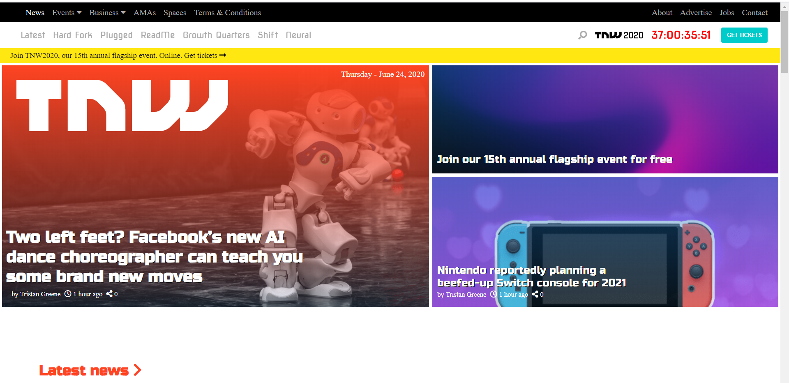
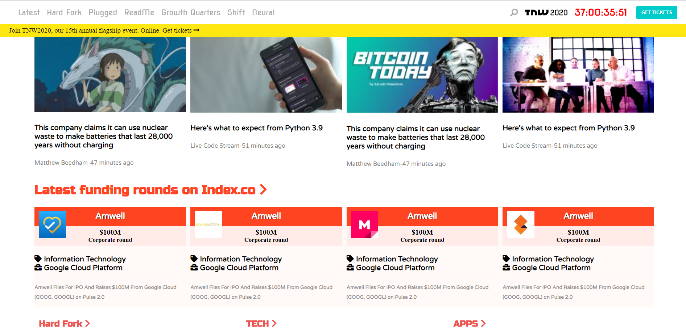
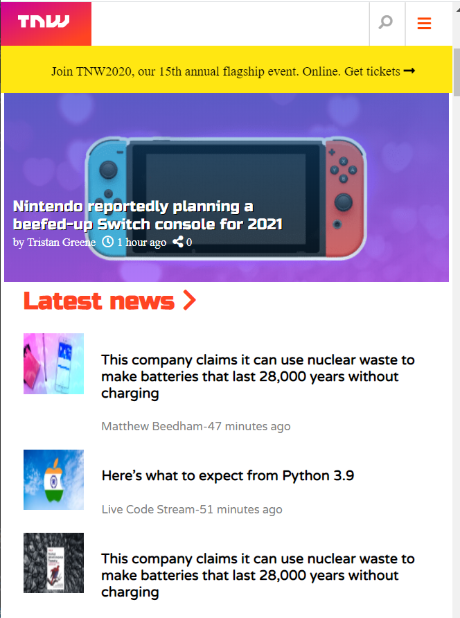

# The-Next-Web

This is a fully responsive replica of the The Next web website landing page.  

</h1>Additional description about the project and its features.</h1>

<h2>Built With</h2>

Html

CSS

Atom editor, Visual code

<h2>Live Demo</h2>
https://pensive-booth-3ecd98.netlify.app/

<h2>Getting Started</h2>
To get a local copy up and running follow these simple example steps.

Prerequisites
Text editor,Github profile and Git.

<h2>Authors</h2>

👤 Author1

- Github:https://github.com/ajkacca457

- Twitter:https://twiter.com/ajkacca

- Linkedin: https://www.linkedin.com/in/avijit-karmaker-8738a54a/

👤 Author2

- Github: https://github.com/sinework

- LinkedIn: https://www.linkedin.com/in/sinework-amare-731a6a125/

<h2>🤝Contributing</h2>

Contributions, issues and feature requests are welcome!

Feel free to check the issues page.

Show your support
Give a ⭐️ if you like this project!

📝 <h2>License</h2>
This project is a collaboration project of microverse students. All rights are reserved for Avijit and Sinework.
